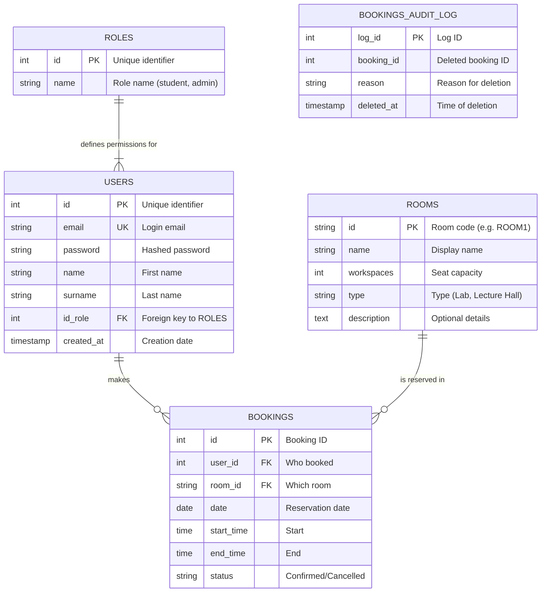

© Aleksandra Gołek | All rights reserved.
This work is legally protected and requires permission for use.
## What is SPOT? ✨

> Smart Place Organization Tool | "Your campus. Your space. Your SPOT."

**Say goodbye to booking conflicts, uncertainty, and the hassle of manually searching for available rooms. SPOT (Smart Place Organization Tool) is a revolutionary platform for academic space management, designed for the prestige and dynamism of the modern university.**

SPOT combines an elegant interface with a powerful organizational engine that automates the booking process for rooms, labs, and lecture halls. It's a tool that brings order and peace of mind, allowing the entire academic community to focus on what matters most: learning, development, and collaboration.

Read the documentation:
## 📋 Table of Contents
0. Technologies
1. Start-up
2. Architecture & Structure
3. Database (ERD & advanced SQL elements)
4. Main functionalities
5. Manual test scenario
6. .... Tests
7. Requirements Checklist

## 💻 Technologies
The project is implemented in accordance with the strict requirements (no PHP frameworks):
* **Backend:** PHP 8.3 (Object-Oriented, PDO, MVC Pattern)
* **Frontend:** HTML5, CSS3 (Responsive/Flexbox/Grid), JavaScript (Vanilla + Fetch API)
* **Database:** PostgreSQL 16
* **Containerization:** Docker & Docker Compose
* **Web Server:** Nginx (Alpine)

## 🚀 Start-up

1.  Make sure you have Docker installed.
2.  Clone the repo and go to project directory.
3.  Launch the app with:
    ```bash
    docker-compose up --build
    ```
4.  **App:** `http://localhost:8080`
5.  **PgAdmin:** `http://localhost:5050` (Login: `admin@example.com`, Hasło: `admin`)

**Default login:**
* **Student:** `student@spot.com` 
* **Admin:** `admin@example.com`

## 🏗 Architecture & Structure

App is based on **MVC (Model-View-Controller)**. All traffic is managed by `index.php` (Front Controller) and class `Routing`.

**Layer diagram:**

```mermaid
graph TD
    User((Użytkownik)) --> Browser[Przeglądarka / JS Fetch]
    Browser -- HTTP Request --> Nginx[Nginx :8080]
    Nginx -- FastCGI --> PHP[Kontener PHP :9000]
    
    subgraph Backend PHP
    PHP --> Router[Routing.php]
    Router --> Controller[Controller]
    Controller --> Model[Model]
    Controller --> View[View / Template]
    Model --> Repo[Repository]
    end
    
    Repo -- PDO --> DB[(PostgreSQL :5432)]
```



## 🗄 Database
### Entity Relationship Diagram (ERD)



## Advanced SQL elements
Views: 
- vw_booking_details: Aggregates booking data with user and room details using JOINs.
- vw_room_stats: Calculates usage statistics for each room.
  
Trigger:
- trg_log_booking_delete: Automatically saves information about deleted bookings into the bookings_audit_log table for security/audit purposes.
  
Procedure:
- clean_archived_bookings: A stored procedure that cleans up historical reservation data to maintain database performance.


## 🌟 Main functionalities
- Logging and sesions: Secure authentication with password hashing.
- Roles: Role system (Student/Teacher/Admin) with access blocking (Middleware checkAdmin).
- Reservations: Interactive SVG map, date&time validation, bookings list, database conflict resolving.
- Admin panel: User, rooms, bookings management (CRUD).
- User profile: User data edition.


## 🧪 Test Scenario
<table> <tr> <td width="33%" valign="top"> <strong>Log in.</strong>


 </td> <td width="33%" valign="top"> <strong>Log in. (Mobile view)</strong>


 </td> <td width="33%" valign="top"> <strong>Invalid password.</strong>


 </td> </tr> <tr> <td valign="top"> <strong>See current bookings.</strong>


 </td> <td valign="top"> <strong>Adding reservation.</strong>


 </td> <td valign="top"> <strong>Trying to add reservation with no chosen room.</strong>


 </td> </tr> <tr> <td valign="top"> <strong>Choosing the room from the map and details display.</strong>


 </td> <td valign="top"> <strong>Valid date, time and room. Proceeding to make a booking.</strong>


 </td> <td valign="top"> <strong>New reservation visibe on the list. Old bookings are deleted automatically.</strong>


 </td> </tr> <tr> <td valign="top"> <strong>Editing any chosen reservation (date, time, room).</strong>


 </td> <td valign="top"> <strong>Choosing the time from the past. Message displayed.</strong>


 </td> <td valign="top"> <strong>Dipslay user profile.</strong>


 </td> </tr> <tr> <td valign="top"> <strong>Edit user profile (name, lastname, password).</strong>


 </td> <td valign="top"> <strong>Profile data updated.</strong>


 </td> <td valign="top"> <strong>Log out. Log in as admin.</strong>


 </td> </tr> <tr> <td valign="top"> <strong>Display users and change their role.</strong>


 </td> <td valign="top"> <strong>Edit user.</strong>


 </td> <td valign="top"> <strong>Display rooms and add new room.</strong>


 </td> </tr> <tr> <td valign="top"> <strong>Manage user bookings.</strong>


 </td> <td valign="top"> <strong>Search by the keywords.</strong>


 </td> <td valign="top"> <strong>Non existing page (404).</strong>


 </td> </tr> <tr> <td valign="top"> <strong>Triggered (from the code level) exception (500).</strong>


 </td> <td valign="top"> <strong>Trying to access admin page being logged in as a student/teacher.</strong>


 </td> <td valign="top"> </td> </tr> </table>

## 📱 Mobile Views

<table> <tr> <td width="25%" valign="top"> <strong>Log in page.</strong>


 </td> <td width="25%" valign="top"> <strong>Register account. Type non identical passwords.</strong>


 </td> <td width="25%" valign="top"> <strong>Successful login.</strong>


 </td> <td width="25%" valign="top"> <strong>Add reservation.</strong>


 </td> </tr> <tr> <td valign="top"> <strong>Chosen room.</strong>


 </td> <td valign="top"> <strong>Booking is chosen to be less than 15 minutes long. Message displayed.</strong>


 </td> <td valign="top"> <strong>Display info about SPOT!</strong>


 </td> <td valign="top"> <strong>Admin view: manage users.</strong>


 </td> </tr> <tr> <td valign="top"> <strong>Admin view: manage users' bookings. Delete a reservation.</strong>


 </td> <td valign="top"> <strong>Log out. Successfully redirected to log in page and user logged out.</strong>


 </td> </tr> </table>


## ✅ Requirements Checklist
[x] Technologies: Docker, GIT, HTML5, CSS, JS, PHP, PostgreSQL.

[x] MVC Architecture without frameworks.

[x] Responsive Design (Media Queries).

[x] Login, Sessions, Permissions.

[x] Database: Relationships, 3rd Normal Form.

[x] Views (2), Trigger (1), Procedure (1).

[x] SQL Transactions (during reservation).

[x] Fetch API (room availability check).

[x] Tests (PHPUnit + Bash).

[x] Error Handling (400, 403, 404, 500 pages).

[x] Documentation and README.


..................................................................................................................................
<h3>PROGRAMMED VIEWS</h3>

<div style="display: flex; flex-wrap: wrap; gap: 10px; justify-content: center;">
  
  
  
  
  
  
  
  
  
  
</div>


Desktop versions


Mobile


