© Aleksandra Gołek | All rights reserved.
This work is legally protected and requires permission for use.
## What is SPOT? ✨

> Smart Place Organization Tool | "Your campus. Your space. Your SPOT."

**Say goodbye to booking conflicts, uncertainty, and the hassle of manually searching for available rooms. SPOT (Smart Place Organization Tool) is a revolutionary platform for academic space management, designed for the prestige and dynamism of the modern university.**

SPOT combines an elegant interface with a powerful organizational engine that automates the booking process for rooms, labs, and lecture halls. It's a tool that brings order and peace of mind, allowing the entire academic community to focus on what matters most: learning, development, and collaboration.
## 🚀 Start-up

1.  Make sure you have Docker installed.
2.  Clone the repo and go to project directory.
3.  Launch the app with:
    ```bash
    docker-compose up --build
    ```
4.  **App:** `http://localhost:8080`
5.  **PgAdmin:** `http://localhost:5050` (Login: `admin@example.com`, Hasło: `admin`)

**Default login:**
* **Student:** `student@spot.com` 
* **Admin:** `admin@example.com`

## 🏗 Architecture & Structure

App is based on **MVC (Model-View-Controller)**. All traffic is managed by `index.php` (Front Controller) and class `Routing`.

**Layer diagram:**

```mermaid
graph TD
    User((Użytkownik)) --> Browser[Przeglądarka / JS Fetch]
    Browser -- HTTP Request --> Nginx[Nginx :8080]
    Nginx -- FastCGI --> PHP[Kontener PHP :9000]
    
    subgraph Backend PHP
    PHP --> Router[Routing.php]
    Router --> Controller[Controller]
    Controller --> Model[Model]
    Controller --> View[View / Template]
    Model --> Repo[Repository]
    end
    
    Repo -- PDO --> DB[(PostgreSQL :5432)]
```


## Database
### Entity Relationship Diagram (ERD)
## 🗄 Database

### Entity Relationship Diagram (ERD)


### Relationships
.........

## Advanced SQL elements
* Views: vw_booking_details (details with table joining), vw_room_stats (usage stats).
* Trigger: trg_log_booking_delete - automatically logs deleted bookings to the table bookings_audit_log.
* Procedure: clean_archived_bookings - deletes old bookings (from the past).

<h3>PROGRAMMED VIEWS</h3>

<div style="display: flex; flex-wrap: wrap; gap: 10px; justify-content: center;">
  
  
  
  
  
  
  
  
  
  
</div>

<h3>ERD DIAGRAM and STRUCTURE</h3>
SOON...........

<h3>PROTOTYPES</h3>

Desktop versions


Mobile


