© Aleksandra Gołek | All rights reserved.
This work is legally protected and requires permission for use.
## What is SPOT? ✨

> Smart Place Organization Tool | "Your campus. Your space. Your SPOT."

**Say goodbye to booking conflicts, uncertainty, and the hassle of manually searching for available rooms. SPOT (Smart Place Organization Tool) is a revolutionary platform for academic space management, designed for the prestige and dynamism of the modern university.**

SPOT combines an elegant interface with a powerful organizational engine that automates the booking process for rooms, labs, and lecture halls. It's a tool that brings order and peace of mind, allowing the entire academic community to focus on what matters most: learning, development, and collaboration.

Read the documentation:
## 📋 Table of Contents
0. Technologies
1. Start-up
2. Architecture & Structure
3. Database (ERD & advanced SQL elements)
4. Main functionalities
5. Manual test scenario
6. Quality by Lighthouse
7. Requirements Checklist

## 💻 0. Technologies
The project is implemented in accordance with the strict requirements (no PHP frameworks):
* **Backend:** PHP 8.3 (Object-Oriented, PDO, MVC Pattern)
* **Frontend:** HTML5, CSS3 (Responsive/Flexbox/Grid), JavaScript (Vanilla + Fetch API)
* **Database:** PostgreSQL 16
* **Containerization:** Docker & Docker Compose
* **Web Server:** Nginx (Alpine)

## 🚀 1. Start-up

1.  Make sure you have Docker installed.
2.  Clone the repo and go to project directory.
3.  Launch the app with:
    ```bash
    docker-compose up --build
    ```
4.  **App:** `http://localhost:8080`
5.  **PgAdmin:** `http://localhost:5050` (Login: `admin@example.com`, Hasło: `admin`)

**Default login examples (u can make users like that):**
* **Student:** `student@spot.com` 
* **Admin:** `admin@example.com`

## 🏗 2. Architecture & Structure

App is based on **MVC (Model-View-Controller)**. All traffic is managed by `index.php` (Front Controller) and class `Routing`.

**Layer diagram:**

```mermaid
graph TD
    User((Użytkownik)) --> Browser[Przeglądarka / JS Fetch]
    Browser -- HTTP Request --> Nginx[Nginx :8080]
    Nginx -- FastCGI --> PHP[Kontener PHP]
    
    subgraph Backend PHP
    PHP --> Router[Routing.php]
    Router --> Controller[Controller]
    Controller --> Model[Model]
    Controller --> View[View / Template]
    Model --> Repo[Repository]
    end
    
    Repo -- PDO --> DB[(PostgreSQL :5432)]
```



## 🗄 3 Database
### Entity Relationship Diagram (ERD)


## Advanced SQL elements
Views: 
- vw_booking_details: Aggregates booking data with user and room details using JOINs.
- vw_room_stats: Calculates usage statistics for each room.
  
Trigger:
- trg_log_booking_delete: Automatically saves information about deleted bookings into the bookings_audit_log table for security/audit purposes.
  
Procedure:
- clean_archived_bookings: A stored procedure that cleans up historical reservation data to maintain database performance.

Stored function:
- log_booking_deletion(): Contains the logic executed by the trigger. Captures the details of a deleted booking (ID, user, room) and inserts a record into the bookings_audit_log table.

Transaction: To ensure data integrity. Multiple SQL operations are treated as a single atomic unit—either all succeed, or all fail (rollback).
- User Registration: When adding new user, system inserts it into the users table and creates a log entry in user_creation_logs in 1 transaction.
- Reservations: When creating or updating a booking, the system validates the logic and saves the booking data inside a transaction to prevent race conditions or partial updates.


## 🌟 4. Main functionalities
- Logging and sesions: Secure authentication with password hashing.
- Registration: live input validation.
- Roles: Role system (Student/Teacher/Admin) with access blocking (Middleware checkAdmin).
- Reservations: Interactive SVG map, date&time validation, bookings list, database conflict resolving.
- Admin panel: User, rooms, bookings management (CRUD).
- User profile: User data edition.


## 🧪 5. Test Scenario

<table>
  <tr>
    <td width="50%" valign="top">
      <strong>1. Log in.</strong><br>
      
    </td>
    <td width="50%" valign="top">
      <strong>2. See current bookings.</strong><br>
      
    </td>
  </tr>
  <tr>
    <td valign="top">
      <strong>3. Adding reservation.</strong><br>
      
    </td>
    <td valign="top">
      <strong>4. Trying to add reservation with no chosen room.</strong><br>
      
    </td>
  </tr>
  <tr>
    <td valign="top">
      <strong>5. Choosing the room from the map and details display.</strong><br>
      
    </td>
    <td valign="top">
      <strong>6. Valid date, time and room. Proceeding to make a booking.</strong><br>
      
    </td>
  </tr>
  <tr>
    <td valign="top">
      <strong>7. New reservation visibe on the list. Old bookings are deleted automatically.</strong><br>
      
    </td>
    <td valign="top">
      <strong>8. Editing any chosen reservation (date, time, room).</strong><br>
      
    </td>
  </tr>
  <tr>
    <td valign="top">
      <strong>9. Choosing the time from the past. Message displayed.</strong><br>
      
    </td>
    <td valign="top">
      <strong>10. Dipslay user profile.</strong><br>
      
    </td>
  </tr>
  <tr>
    <td valign="top">
      <strong>11. Edit user profile (name, lastname, password).</strong><br>
      
    </td>
    <td valign="top">
      <strong>12. Profile data updated.</strong><br>
      
    </td>
  </tr>
  <tr>
    <td valign="top">
      <strong>13. Log out. Log in as admin.</strong><br>
      
    </td>
    <td valign="top">
      <strong>14. Display users and change their role.</strong><br>
      
    </td>
  </tr>
  <tr>
    <td valign="top">
      <strong>15. Edit user.</strong><br>
      
    </td>
    <td valign="top">
      <strong>16. Display rooms and add new room.</strong><br>
      
    </td>
  </tr>
  <tr>
    <td valign="top">
      <strong>17. Manage user bookings.</strong><br>
      
    </td>
    <td valign="top">
      <strong>18. Search by the keywords.</strong><br>
      
    </td>
  </tr>
  <tr>
    <td valign="top">
      <strong>19. Non existing page (404).</strong><br>
      
    </td>
    <td valign="top">
      <strong>20. Triggered (from the code level) exception (500).</strong><br>
      
    </td>
  </tr>
  <tr>
    <td valign="top">
      <strong>21. Trying to access admin page being logged in as a student/teacher.</strong><br>
      
    </td>
    <td valign="top">
        <strong>22. Admin adding a room that ID already exists in db - message displayed.</strong><br>
        

      </td>
  </tr>
</table>

## 📱 Mobile Views

<table> <tr> <td width="25%" valign="top"> <strong>Log in page.</strong>


 </td> <td width="25%" valign="top"> <strong>Register account. Type non identical passwords.</strong>


 </td> <td width="25%" valign="top"> <strong>Successful login.</strong>


 </td> <td width="25%" valign="top"> <strong>Add reservation.</strong>


 </td> </tr> <tr> <td valign="top"> <strong>Chosen room.</strong>


 </td> <td valign="top"> <strong>Booking is chosen to be less than 15 minutes long. Message displayed.</strong>


 </td> <td valign="top"> <strong>Display info about SPOT!</strong>


 </td> <td valign="top"> <strong>Admin view: manage users.</strong>


 </td> </tr> <tr> <td valign="top"> <strong>Admin view: manage users' bookings. Delete a reservation.</strong>


 </td> <td valign="top"> <strong>Log out. Successfully redirected to log in page and user logged out.</strong>


 </td> </tr> </table>

## 6. Quality rated by Lighthouse: AMAZING!

<table>
  <tr>
    <td width="50%" valign="top">
      <strong>My bookings page.</strong><br>
      
    </td>
    <td width="50%" valign="top">
      <strong>Reservation page.</strong><br>
      
    </td>
  </tr>
</table>

## ✅ 7. Requirements Checklist
- Technologies: Docker, GIT, HTML5, CSS, JS, PHP, PostgreSQL.
- MVC Architecture without frameworks.
- Responsive Design (Media Queries).
- Login, Sessions, Permissions.
- Database: Relationships, 3rd Normal Form.
- Views (2), Trigger (1), Procedure (1).
- SQL Transactions (during reservation).
- Fetch API (room availability check).
- Tests (PHPUnit + Bash).
- Error Handling (400, 403, 404, 500 pages).
- Documentation and README.

## 8. Areas of improvement (future)
1) Filtering and sorting options for the user tables (as there is for admin).
2) Dynamic map change.
3) More specific limits (e.g. booking should not only last over 15 minutes but less than...) for booking.
4) Interactive messages after having completed reservation.
5) Booking assigned to teacher having more priority than student one.
6) Confirm reservation button 15 minutes before the reservation.
7) Room booking by: capacity, purpose, equipement. Not limiting by date and time.
